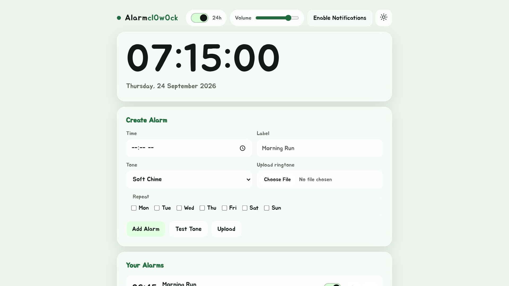

# Alarm Clock

A simple, free alarm clock that runs in the browser. Set repeating alarms with
labels, pick a built-in tone or upload your own, and install it as an app to
use offline.

**Live:** <https://alarm.uwuapps.org/>

Part of [UwU Apps](https://uwuapps.org/) by Augy Studios.



## Features

- Live clock with a 12h / 24h toggle
- One-time or repeating alarms (pick any days of the week), each with a label
- Four built-in tones synthesised with Web Audio: Soft Chime, Classic Beep,
  Deep Pulse, Arpeggio
- Upload your own ringtone (up to 25 MB), stored on the device
- Snooze for 5 minutes, or stop
- Optional system notifications and vibration when an alarm rings
- Light, dark or time-based mode, and 7 brand colours
- Installable PWA that works offline, with an in-page prompt when an update is
  ready

Everything is stored in the browser. There is no account and no server-side
data.

> Alarms are checked by the open page, so they only ring while the app is open
> (in a tab or as an installed app). Closing it stops them.

## Repository layout

| Path | What it is |
| --- | --- |
| [`main-site/`](main-site/) | The site itself: static HTML, CSS and JS, deployed to Vercel. See its [README](main-site/README.md). |
| [`uwuapps-theme.md`](uwuapps-theme.md) | Shared UwU Apps theme spec (brand colours, light/dark/time mode). |
| [`uwuapps-retrofit-time-mode.md`](uwuapps-retrofit-time-mode.md) | Prompt for adding time-based mode to an app that already has the theme system. |
| [`update-bar-spec.md`](update-bar-spec.md) | Spec for the service worker update bar. |

## Running locally

There is no build step. Serve `main-site/` with any static server:

```sh
npx serve main-site
```

Then open the URL it prints. Service workers and notifications need `localhost`
or HTTPS, so opening `index.html` straight from disk won't work fully.

## Deploying

`main-site/` is deployed to Vercel as a static site (config in
[`main-site/vercel.json`](main-site/vercel.json)). Before each deploy, bump
`VERSION` in [`main-site/sw.js`](main-site/sw.js), or nobody gets the new
version. See the [main-site README](main-site/README.md#deploying) for details.

## Contributing

Issues and pull requests are welcome. Please follow the
[Code of Conduct](CODE_OF_CONDUCT.md).

## License

[MIT](LICENSE) © 2026 Augy Studios
